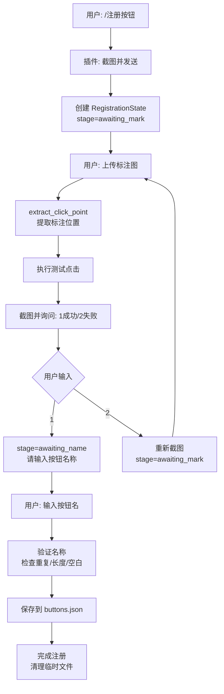

# astrbot_plugin_galplayer 架构分析文档

**文档版本**: 1.0.0  
**分析日期**: 2024年  
**目的**: 为即将开发的自动注册功能提供架构参考

---

## 目录

1. [main.py 核心结构](#1-mainpy-核心结构)
2. [buttons.json 数据结构](#2-buttonsjson-数据结构)
3. [现有交互流程](#3-现有交互流程)
4. [plugin.md 开发规范](#4-pluginmd-开发规范)
5. [依赖与工具](#5-依赖与工具)
6. [API 接口列表](#6-api-接口列表)
7. [自动注册功能开发建议](#7-自动注册功能开发建议)

---

## 1. main.py 核心结构

### 1.1 插件类定义

```python
@register(PLUGIN_NAME, "随风潜入夜", "和群友一起推 Galgame", "1.2.0")
class GalgamePlayerPlugin(Star):
    def __init__(self, context: Context, config: AstrBotConfig):
        super().__init__(context)
        self.config = config
        self.game_sessions = {}              # 游戏会话管理
        self.buttons_data = load_buttons_data()  # 按钮数据
        self.registration_states = {}        # 注册流程状态
        self.temp_img_dir = Path("data") / "tmp" / "galplayer"
```

**关键组件**:
- `@register` 装饰器：向 AstrBot 注册插件元数据
- `game_sessions`: Dict[session_id, session_info] - 按会话管理窗口和状态
- `buttons_data`: Dict[window_title, Dict[button_name, coords]] - 按钮坐标存储
- `registration_states`: Dict[session_id, RegistrationState] - 按钮注册流程状态

### 1.2 运行模式切换

插件支持两种运行模式：

| 模式 | 适用场景 | 实现方式 |
|------|---------|---------|
| **local** | Windows 本机直接控制 | `local_operations.py` (pywin32) |
| **remote** | 跨网络远程控制 | `RemoteControlServer` (websockets) |

**初始化逻辑**:
```python
self.mode = self.config.get("mode", "local")

if self.mode == "local":
    # 检查是否为 Windows 系统
    # 加载 local_operations 模块
    
if self.mode == "remote":
    # 检查 websockets 依赖
    # 启动 RemoteControlServer
    # 验证 secret_token 配置
```

### 1.3 命令注册方式

插件使用 AstrBot 的装饰器系统注册命令：

```python
# 命令组（支持别名）
@filter.command_group("gal", alias={"g"})
async def gal_group(self): ...

# 子命令
@gal_group.command("start", alias={"开始游戏"})
async def start_game(self, event: AstrMessageEvent, window_title: str):
    yield event.plain_result("消息内容")
    
# 独立命令
@filter.command("注册按钮", alias={"register_button"})
async def register_button(self, event: AstrMessageEvent):
    ...
    
# 全局消息监听
@filter.event_message_type(filter.EventMessageType.GROUP_MESSAGE | ...)
async def on_advance_message(self, event: AstrMessageEvent):
    if await self._maybe_handle_registration(event):
        event.stop_event()
```

**已注册命令列表**:
- `/gal start <窗口标题>` - 启动游戏会话
- `/gal stop` - 停止游戏会话
- `/gal resend` / `/gal 重发` - 重新发送截图
- `/gal help` / `/gal 帮助` - 显示帮助信息
- `/注册按钮` / `/register_button` - 开始按钮注册流程
- `/点 <按钮名>` / `/click <按钮名>` - 点击已注册按钮
- `/按钮列表` / `/button_list` - 查看已注册按钮
- `/删除按钮 <按钮名>` / `/remove_button <按钮名>` - 删除按钮
- `/输入 <按键>` / `/输 <按键>` / `/type <按键>` - 模拟按键
- `g` 或 `gal` (快捷消息) - 快速前进

### 1.4 会话状态管理

**会话 ID 生成**:
```python
def get_session_id(self, event: AstrMessageEvent) -> str:
    group_id = event.get_group_id()
    return f"group_{group_id}" if group_id else f"private_{event.get_sender_id()}"
```

**会话数据结构**:
```python
# 本地模式
{
    "window": <pygetwindow.Window>,      # 窗口对象
    "window_title": "窗口标题",
    "last_triggered_time": 0.0,          # 防刷屏时间戳
    "save_path": Path(".../<session_id>.png")  # 截图保存路径
}

# 远程模式
{
    "window_title": "窗口标题",
    "last_triggered_time": 0.0,
    "save_path": Path(".../<session_id>.png")
}
```

**冷却机制**:
```python
cooldown = self.config.get("cooldown_seconds", 3.0)
if time.time() - session["last_triggered_time"] < cooldown:
    return  # 拒绝过快触发
session["last_triggered_time"] = time.time()
```

### 1.5 注册状态数据类

```python
@dataclass
class RegistrationState:
    stage: str                                  # 流程阶段
    initiator_id: str                           # 发起用户 ID
    window_title: str                           # 窗口标题
    original_path: Path                         # 原始截图路径
    screenshot_size: Optional[Tuple[int, int]]  # 截图尺寸
    annotated_path: Optional[Path]              # 标注图路径
    point_ratio: Optional[Tuple[float, float]]  # 归一化坐标
    timeout_task: Optional[asyncio.Task]        # 超时任务
    temp_paths: list[Path]                      # 临时文件列表
    last_event: Optional[AstrMessageEvent]      # 最后事件
```

**流程阶段**:
- `awaiting_mark`: 等待用户上传标注图
- `awaiting_confirm`: 等待用户确认点击结果（1/2）
- `awaiting_name`: 等待用户输入按钮名称

### 1.6 消息处理接口

**发送纯文本**:
```python
yield event.plain_result("文本内容")
await event.send(event.plain_result("主动发送"))
```

**发送图片**:
```python
yield event.image_result(str(image_path))
await event.send(event.image_result(str(image_path)))
```

**停止事件传播**:
```python
event.stop_event()  # 阻止其他插件处理该消息
```

---

## 2. buttons.json 数据结构

### 2.1 文件位置

```python
BUTTONS_FILE_NAME = "buttons.json"

def get_plugin_data_path() -> Path:
    return StarTools.get_data_dir(PLUGIN_NAME)
    # 通常为: AstrBot/data/astrbot_plugin_galplayer/buttons.json
```

### 2.2 JSON 结构

```json
{
  "游戏窗口标题1": {
    "按钮名1": {
      "x_ratio": 0.5,
      "y_ratio": 0.8
    },
    "按钮名2": {
      "x_ratio": 0.3,
      "y_ratio": 0.6
    }
  },
  "游戏窗口标题2": {
    "开始按钮": {
      "x_ratio": 0.5,
      "y_ratio": 0.5
    }
  }
}
```

**字段说明**:
- 第一层键：窗口标题（字符串），用于区分不同游戏
- 第二层键：按钮名称（字符串），用户定义的识别名
- `x_ratio`: 水平归一化坐标 (0.0 ~ 1.0)
- `y_ratio`: 垂直归一化坐标 (0.0 ~ 1.0)

### 2.3 读写操作

**读取**:
```python
def load_buttons_data() -> Dict[str, Dict[str, Any]]:
    data_file = get_plugin_data_path() / BUTTONS_FILE_NAME
    if not data_file.exists():
        return {}
    with data_file.open("r", encoding="utf-8") as fp:
        data = json.load(fp)
        if isinstance(data, dict):
            return data
    return {}
```

**写入**:
```python
def save_buttons_data(data: Dict[str, Dict[str, Any]]) -> None:
    data_dir = get_plugin_data_path()
    data_dir.mkdir(parents=True, exist_ok=True)
    data_file = data_dir / BUTTONS_FILE_NAME
    with data_file.open("w", encoding="utf-8") as fp:
        json.dump(data, fp, ensure_ascii=False, indent=2)
```

**注意事项**:
- 每次修改按钮数据后必须调用 `save_buttons_data()` 持久化
- 使用 `ensure_ascii=False` 支持中文按钮名
- 使用 `indent=2` 保持可读性

---

## 3. 现有交互流程

### 3.1 手动按钮注册流程



**关键函数**:
1. `register_button()` - 启动注册流程
2. `_maybe_handle_registration()` - 处理注册过程中的用户输入
3. `_schedule_registration_timeout()` - 设置超时机制
4. `_clear_registration_state()` - 清理注册状态

### 3.2 图像标注解析流程

**函数**: `image_utils.extract_click_point(original_path, annotated_path)`

```python
# 流程概述
1. 加载原始截图和标注图
2. 调整标注图尺寸匹配原图（如有必要）
3. 计算两图差异 (cv2.absdiff)
4. 灰度化、高斯模糊、OTSU 阈值化
5. 形态学操作去噪 (开运算 + 闭运算)
6. 查找外部轮廓 (cv2.findContours)
7. 过滤小面积轮廓（至少占 0.05% 画面）
8. 选择最大轮廓并计算质心
9. 返回 (centroid_x, centroid_y), (width, height)
```

**异常处理**:
- `ImageProcessingError`: 读取失败、长宽比变化过大、无有效标注、标注过小

### 3.3 截图功能实现

#### 本地模式 (local_operations.py)

```python
def screenshot_window(window, save_path: str):
    hwnd = window._hWnd
    # 1. 恢复最小化窗口
    if win32gui.IsIconic(hwnd):
        win32gui.ShowWindow(hwnd, win32con.SW_RESTORE)
    
    # 2. 获取窗口尺寸
    left, top, right, bottom = win32gui.GetWindowRect(hwnd)
    width, height = right - left, bottom - top
    
    # 3. 使用 PrintWindow 后台截图
    hwnd_dc = win32gui.GetWindowDC(hwnd)
    mfc_dc = win32ui.CreateDCFromHandle(hwnd_dc)
    save_dc = mfc_dc.CreateCompatibleDC()
    save_bitmap = win32ui.CreateBitmap()
    save_bitmap.CreateCompatibleBitmap(mfc_dc, width, height)
    save_dc.SelectObject(save_bitmap)
    ctypes.windll.user32.PrintWindow(hwnd, save_dc.GetSafeHdc(), 3)
    
    # 4. 转换为 PIL Image 并保存
    bmp_str = save_bitmap.GetBitmapBits(True)
    im = Image.frombuffer("RGB", (width, height), bmp_str, "raw", "BGRX", 0, 1)
    im.save(save_path)
```

#### 远程模式 (api.py + remote_client.py)

```python
# 服务端发送命令
async def remote_screenshot(self, session_id: str, save_path: str, delay: float):
    request_id = str(uuid.uuid4())
    command = {
        "action": "screenshot",
        "session_id": session_id,
        "request_id": request_id,
        "delay": delay
    }
    await self._send_command(command)
    screenshot_bytes = await asyncio.wait_for(future, timeout=15.0)
    with open(save_path, "wb") as f:
        f.write(screenshot_bytes)

# 客户端执行截图并返回 Base64
# remote_client.py 使用相同的 PrintWindow 技术
# 然后通过 websocket 发送编码后的图像数据
```

### 3.4 点击模拟实现

#### 归一化坐标计算

```python
async def _perform_click_at_ratio(
    self, event, session, ratio: Tuple[float, float]
):
    # 确保比率在 0~1 范围内
    x_ratio = max(0.0, min(1.0, ratio[0]))
    y_ratio = max(0.0, min(1.0, ratio[1]))
    
    if self.mode == "remote":
        await self.remote_server.remote_click(
            session_id, x_ratio, y_ratio, method
        )
    elif self.mode == "local":
        await asyncio.to_thread(
            local_operations.click_on_window,
            window, x_ratio, y_ratio, method
        )
```

#### 本地点击 (local_operations.py)

```python
def click_on_window(window, x_ratio: float, y_ratio: float, method: str):
    # 1. 获取窗口度量（边框、客户区尺寸）
    metrics = get_window_metrics(window)
    
    # 2. 计算窗口坐标
    click_x_window = int(round(x_ratio * (metrics["window_width"] - 1)))
    click_y_window = int(round(y_ratio * (metrics["window_height"] - 1)))
    
    # 3. 转换为客户区坐标
    client_x = click_x_window - metrics["border_left"]
    client_y = click_y_window - metrics["border_top"]
    
    # 4. 根据方法执行点击
    if method == "SendInput":
        # 激活窗口并移动光标点击
        screen_x = metrics["screen_left"] + metrics["border_left"] + client_x
        screen_y = metrics["screen_top"] + metrics["border_top"] + client_y
        win32api.SetCursorPos((screen_x, screen_y))
        win32api.mouse_event(win32con.MOUSEEVENTF_LEFTDOWN, 0, 0, 0, 0)
        time.sleep(0.02)
        win32api.mouse_event(win32con.MOUSEEVENTF_LEFTUP, 0, 0, 0, 0)
    else:  # PostMessage
        l_param = (client_y << 16) | (client_x & 0xFFFF)
        win32api.PostMessage(hwnd, win32con.WM_LBUTTONDOWN, ...)
        win32api.PostMessage(hwnd, win32con.WM_LBUTTONUP, ...)
```

**方法对比**:

| 方法 | 优点 | 缺点 | 适用场景 |
|------|------|------|----------|
| **PostMessage** | 可后台运行，不需要激活窗口 | 部分游戏可能拦截或忽略 | 后台自动化 |
| **SendInput** | 兼容性最强，几乎所有游戏都支持 | 需要窗口在前台，会移动鼠标 | 用户参与场景 |

### 3.5 按键模拟实现

```python
def press_key_on_window(window, key_name: str, method: str):
    # 1. 键名映射到虚拟键码
    VK_CODE = {
        "space": 0x20, "enter": 0x0D, "up": 0x26, ...
    }
    key_code = VK_CODE.get(key_name.lower())
    
    # 2. 获取扫描码
    scan_code = win32api.MapVirtualKey(key_code, 0)
    
    # 3. 根据方法执行
    if method == "SendInput":
        # 构造 INPUT 结构并调用 SendInput
        ip_down = INPUT(type=1, ki=KEYBDINPUT(...))
        ctypes.windll.user32.SendInput(1, ctypes.byref(ip_down), ...)
        time.sleep(0.05)
        ip_up = INPUT(type=1, ki=KEYBDINPUT(...))
        ctypes.windll.user32.SendInput(1, ctypes.byref(ip_up), ...)
    else:  # PostMessage
        # 构造 lParam 并发送 WM_KEYDOWN/WM_KEYUP
        lParam_down = 1 | (scan_code << 16)
        win32api.PostMessage(hwnd, win32con.WM_KEYDOWN, key_code, lParam_down)
        time.sleep(0.05)
        win32api.PostMessage(hwnd, win32con.WM_KEYUP, key_code, lParam_up)
```

### 3.6 超时与清理机制

```python
def _schedule_registration_timeout(self, session_id: str, event):
    state = self.registration_states.get(session_id)
    if state.timeout_task:
        state.timeout_task.cancel()  # 取消旧任务
    
    timeout_seconds = self._get_registration_timeout()
    
    async def timeout_coroutine():
        try:
            await asyncio.sleep(timeout_seconds)
            # 超时后清理状态
            self._clear_registration_state(session_id)
            await event.send(event.plain_result("操作已超时..."))
        except asyncio.CancelledError:
            pass
    
    state.timeout_task = asyncio.create_task(timeout_coroutine())

def _clear_registration_state(self, session_id: str):
    state = self.registration_states.pop(session_id, None)
    if not state:
        return
    # 取消超时任务
    if state.timeout_task:
        state.timeout_task.cancel()
    # 删除所有临时文件
    for temp_path in list(state.temp_paths):
        self._remove_temp_path(state, temp_path)
```

---

## 4. plugin.md 开发规范

### 4.1 插件基本结构

**必需组件**:
- `main.py` - 插件主文件，包含继承自 `Star` 的类
- `metadata.yaml` - 插件元数据（优先级高于 `@register` 装饰器）
- `requirements.txt` - Python 依赖列表

**可选组件**:
- `_conf_schema.json` - 配置项的 JSON Schema
- `README.md` - 插件说明文档
- 其他辅助模块

### 4.2 命令注册规范

```python
from astrbot.api.event import filter, AstrMessageEvent
from astrbot.api.star import Context, Star, register

@register("插件ID", "作者", "描述", "版本", "仓库URL")
class MyPlugin(Star):
    def __init__(self, context: Context):
        super().__init__(context)
    
    # 简单命令
    @filter.command("命令名", alias={"别名1", "别名2"})
    async def my_command(self, event: AstrMessageEvent):
        '''命令描述（会显示在帮助中）'''
        yield event.plain_result("回复内容")
    
    # 带参数的命令
    @filter.command("echo")
    async def echo_command(self, event: AstrMessageEvent, text: str):
        yield event.plain_result(f"你说: {text}")
    
    # 命令组
    @filter.command_group("group", alias={"g"})
    async def my_group(self): ...
    
    @my_group.command("sub")
    async def sub_command(self, event: AstrMessageEvent):
        yield event.plain_result("子命令")
```

### 4.3 事件过滤器

```python
# 监听特定消息类型
@filter.event_message_type(
    filter.EventMessageType.GROUP_MESSAGE |
    filter.EventMessageType.PRIVATE_MESSAGE
)
async def on_message(self, event: AstrMessageEvent):
    # 处理所有群聊和私聊消息
    ...

# 正则匹配
@filter.regex(r"^图片.*")
async def on_image_request(self, event: AstrMessageEvent):
    ...

# 关键词触发
@filter.keyword("关键词")
async def on_keyword(self, event: AstrMessageEvent):
    ...
```

### 4.4 配置管理

**_conf_schema.json 示例**:
```json
{
  "参数名": {
    "description": "参数说明",
    "type": "string",  // string, int, float, bool, object
    "default": "默认值",
    "options": ["选项1", "选项2"]  // 下拉选择
  }
}
```

**访问配置**:
```python
def __init__(self, context: Context, config: AstrBotConfig):
    value = config.get("参数名", "默认值")
```

### 4.5 消息发送接口

```python
# 发送纯文本
yield event.plain_result("文本")
await event.send(event.plain_result("文本"))

# 发送图片
yield event.image_result("图片路径")

# 发送消息链（复杂消息）
from astrbot.core.message.components import Plain, Image, At
yield event.chain_result([
    At(qq="12345"),
    Plain(" 你好！"),
    Image(file="https://example.com/image.jpg")
])
```

### 4.6 异步与错误处理

```python
from astrbot.api import logger

# 使用 logger（不要用 print）
logger.info("信息")
logger.warning("警告")
logger.error("错误", exc_info=True)

# 异步执行阻塞操作
import asyncio

result = await asyncio.to_thread(blocking_function, arg1, arg2)

# 错误处理
try:
    await some_operation()
except Exception as e:
    logger.error(f"操作失败: {e}", exc_info=True)
    yield event.plain_result(f"操作失败: {e}")
```

### 4.7 数据持久化

```python
from astrbot.api.star import StarTools
from pathlib import Path

# 获取插件数据目录
data_dir = StarTools.get_data_dir("插件ID")
data_dir.mkdir(parents=True, exist_ok=True)

# 读写文件
config_file = data_dir / "config.json"
with config_file.open("r", encoding="utf-8") as f:
    data = json.load(f)
```

### 4.8 生命周期钩子

```python
class MyPlugin(Star):
    def __init__(self, context: Context):
        '''插件加载时调用'''
        super().__init__(context)
        # 初始化资源
    
    async def terminate(self):
        '''插件卸载时调用'''
        # 清理资源、关闭连接等
        logger.info("插件已卸载")
```

---

## 5. 依赖与工具

### 5.1 核心依赖 (requirements.txt)

```text
websockets>=12.0        # 远程控制服务器
Pillow>=10.0.0          # 图像处理
opencv-python>=4.8.0    # 图像分析
numpy>=1.24.0           # 数值计算
pywin32>=306 ; sys_platform == 'win32'       # Windows API
pygetwindow>=0.0.9 ; sys_platform == 'win32' # 窗口管理
```

### 5.2 模块功能说明

#### image_utils.py

**功能**: 图像差异检测与标注解析

**核心函数**:
```python
def extract_click_point(
    original_path: PathLike,
    annotated_path: PathLike
) -> Tuple[Tuple[int, int], Tuple[int, int]]:
    """
    提取标注区域的质心坐标
    
    Returns:
        ((centroid_x, centroid_y), (width, height))
    """
```

**技术栈**:
- OpenCV (cv2): 图像处理、轮廓检测
- NumPy: 数组操作

**处理流程**:
1. 图像加载与尺寸验证
2. 差异计算 (absdiff)
3. 灰度化与去噪 (GaussianBlur)
4. 自适应阈值化 (OTSU)
5. 形态学处理 (开/闭运算)
6. 轮廓提取与筛选
7. 质心计算

#### local_operations.py

**功能**: Windows 本地窗口控制

**核心函数**:
```python
def find_game_window(window_title: str) -> Window
    """查找窗口"""

def screenshot_window(window, save_path: str) -> str
    """后台截图"""

def press_key_on_window(window, key_name: str, method: str)
    """模拟按键"""

def click_on_window(window, x_ratio: float, y_ratio: float, method: str)
    """模拟点击"""

def get_window_metrics(window) -> dict
    """获取窗口度量"""
```

**技术栈**:
- pywin32: Windows API 封装
- pygetwindow: 窗口管理
- ctypes: 底层 Win32 API 调用
- Pillow: 图像保存

**关键 API**:
- `win32gui.GetWindowRect()` - 获取窗口矩形
- `win32gui.ClientToScreen()` - 坐标转换
- `ctypes.windll.user32.PrintWindow()` - 后台截图
- `win32api.PostMessage()` - 发送窗口消息
- `ctypes.windll.user32.SendInput()` - 模拟输入

#### api.py

**功能**: 远程控制服务器

**核心类**:
```python
class RemoteControlServer:
    def __init__(self, host, port, secret_token: str)
    
    async def start()
        """启动 WebSocket 服务器"""
    
    async def stop()
        """停止服务器"""
    
    async def remote_start_session(session_id, window_title)
        """通知客户端启动会话"""
    
    async def remote_stop_session(session_id)
        """通知客户端停止会话"""
    
    async def remote_press_key(session_id, key_name, method)
        """远程按键"""
    
    async def remote_click(session_id, x_ratio, y_ratio, method)
        """远程点击"""
    
    async def remote_screenshot(session_id, save_path, delay)
        """远程截图"""
```

**通信协议**:
```json
// 客户端认证
{"type": "auth", "token": "secret_token"}

// 服务器命令
{
  "action": "start_session|stop_session|press_key|click|screenshot",
  "session_id": "group_123",
  "request_id": "uuid",  // 仅截图
  ...其他参数
}

// 客户端响应（截图）
{
  "request_id": "uuid",
  "status": "success|error",
  "image_data": "base64...",  // 成功时
  "error": "错误信息"          // 失败时
}
```

**技术栈**:
- websockets: 异步 WebSocket 服务器
- asyncio: 异步 IO 与任务管理
- base64: 图像数据编码

#### remote/remote_client.py

**功能**: Windows 远程控制客户端

**配置文件**: `gal_client_config.ini`
```ini
[Connection]
ServerURI = ws://服务器地址:8765
SecretToken = 与服务器一致的密钥
```

**工作流程**:
1. 加载配置并连接服务器
2. 发送认证信息
3. 维护 `active_windows` 字典（session_id -> window）
4. 接收命令并执行（截图/按键/点击）
5. 返回执行结果

---

## 6. API 接口列表

### 6.1 AstrBot 框架 API

| 类/模块 | 接口 | 说明 |
|---------|------|------|
| **AstrMessageEvent** | `message_str` | 纯文本消息内容 |
| | `message_obj` | AstrBotMessage 对象 |
| | `get_sender_id()` | 发送者 ID |
| | `get_sender_name()` | 发送者昵称 |
| | `get_group_id()` | 群组 ID（私聊返回 None） |
| | `get_messages()` | 消息链（List[BaseMessageComponent]） |
| | `send(result)` | 主动发送消息 |
| | `plain_result(text)` | 构造纯文本回复 |
| | `image_result(path)` | 构造图片回复 |
| | `chain_result(chain)` | 构造消息链回复 |
| | `stop_event()` | 停止事件传播 |
| **filter** | `@filter.command()` | 注册命令 |
| | `@filter.command_group()` | 注册命令组 |
| | `@filter.event_message_type()` | 过滤消息类型 |
| | `@filter.regex()` | 正则匹配 |
| | `@filter.keyword()` | 关键词触发 |
| **StarTools** | `get_data_dir(plugin_name)` | 获取插件数据目录 |
| **logger** | `info()`, `warning()`, `error()` | 日志记录 |
| **Context** | `context.config` | AstrBot 配置 |
| | `context.plugin_config` | 插件配置 |

### 6.2 插件内部 API

| 模块 | 接口 | 签名 | 说明 |
|------|------|------|------|
| **main.py** | `get_session_id()` | `(event) -> str` | 生成会话 ID |
| | `_perform_click_at_ratio()` | `(event, session, ratio)` | 执行归一化点击 |
| | `_handle_game_action()` | `(event, session, key, screenshot)` | 路由游戏操作 |
| | `_maybe_handle_registration()` | `(event) -> bool` | 处理注册流程 |
| | `_clear_registration_state()` | `(session_id)` | 清理注册状态 |
| | `load_buttons_data()` | `() -> Dict` | 加载按钮数据 |
| | `save_buttons_data()` | `(data: Dict)` | 保存按钮数据 |
| **image_utils.py** | `extract_click_point()` | `(original, annotated) -> ((x,y), (w,h))` | 提取标注位置 |
| **local_operations.py** | `find_game_window()` | `(title) -> Window` | 查找窗口 |
| | `screenshot_window()` | `(window, path) -> str` | 后台截图 |
| | `press_key_on_window()` | `(window, key, method)` | 模拟按键 |
| | `click_on_window()` | `(window, x_ratio, y_ratio, method)` | 模拟点击 |
| | `get_window_metrics()` | `(window) -> dict` | 获取窗口度量 |
| **api.py** | `RemoteControlServer.start()` | `async () -> None` | 启动服务器 |
| | `RemoteControlServer.stop()` | `async () -> None` | 停止服务器 |
| | `RemoteControlServer.remote_start_session()` | `async (sid, title)` | 远程启动会话 |
| | `RemoteControlServer.remote_stop_session()` | `async (sid)` | 远程停止会话 |
| | `RemoteControlServer.remote_press_key()` | `async (sid, key, method)` | 远程按键 |
| | `RemoteControlServer.remote_click()` | `async (sid, x, y, method)` | 远程点击 |
| | `RemoteControlServer.remote_screenshot()` | `async (sid, path, delay)` | 远程截图 |

---

## 7. 自动注册功能开发建议

### 7.1 架构设计建议

#### 7.1.1 数据兼容性

**原则**: 保持与现有 `buttons.json` 格式完全兼容

```python
# 建议: 扩展按钮数据结构（可选字段）
{
  "窗口标题": {
    "按钮名": {
      "x_ratio": 0.5,
      "y_ratio": 0.8,
      # 以下为可选字段，用于自动注册
      "auto_registered": true,           # 标记自动注册
      "registration_method": "ocr|template|...",  # 注册方式
      "confidence": 0.95,                 # 置信度
      "last_verified": "2024-01-01T00:00:00",  # 最后验证时间
      "metadata": {                       # 额外元数据
        "template_path": "...",
        "text": "开始游戏"
      }
    }
  }
}
```

**读写兼容性处理**:
```python
def load_buttons_data() -> Dict[str, Dict[str, Any]]:
    # 现有代码无需修改，自动兼容新字段
    ...

def save_buttons_data(data: Dict[str, Dict[str, Any]]) -> None:
    # 保存时自动包含所有字段（包括扩展字段）
    ...
```

#### 7.1.2 注册流程扩展

**建议**: 新增自动注册命令，与手动注册流程并存

```python
@filter.command("自动注册", alias={"auto_register"})
async def auto_register_button(self, event: AstrMessageEvent, method: str = "ocr"):
    """
    自动识别并注册按钮
    
    Args:
        method: 识别方法 (ocr|template|ai)
    """
    session_id = self.get_session_id(event)
    session = self.game_sessions.get(session_id)
    if not session:
        yield event.plain_result("请先使用 /gal start 启动游戏")
        return
    
    # 1. 截取当前画面
    await self._handle_game_action(event, session, take_screenshot=True)
    
    # 2. 根据方法调用识别引擎
    if method == "ocr":
        buttons = await self._detect_buttons_by_ocr(session)
    elif method == "template":
        buttons = await self._detect_buttons_by_template(session)
    elif method == "ai":
        buttons = await self._detect_buttons_by_ai(session)
    else:
        yield event.plain_result(f"不支持的识别方法: {method}")
        return
    
    # 3. 批量验证与注册
    results = await self._batch_register_buttons(event, session, buttons)
    
    # 4. 反馈结果
    yield event.plain_result(
        f"自动识别完成:\n"
        f"- 发现 {len(buttons)} 个按钮\n"
        f"- 成功注册 {results['success']} 个\n"
        f"- 失败 {results['failed']} 个"
    )
```

#### 7.1.3 识别引擎抽象

```python
# 建议: 创建 auto_registration.py 模块

from abc import ABC, abstractmethod
from typing import List, Tuple

class ButtonDetector(ABC):
    """按钮检测器基类"""
    
    @abstractmethod
    async def detect(
        self,
        screenshot_path: Path
    ) -> List[Tuple[str, float, float, float]]:
        """
        检测按钮位置
        
        Returns:
            List[(button_name, x_ratio, y_ratio, confidence)]
        """
        pass

class OCRButtonDetector(ButtonDetector):
    """基于 OCR 的按钮检测"""
    
    def __init__(self):
        # 可选: PaddleOCR, EasyOCR, Tesseract
        self.ocr = ...
    
    async def detect(self, screenshot_path: Path):
        # 1. OCR 识别文字及位置
        # 2. 过滤按钮关键词（开始、确定、选项等）
        # 3. 返回候选按钮列表
        ...

class TemplateMatchingDetector(ButtonDetector):
    """基于模板匹配的按钮检测"""
    
    def __init__(self, template_dir: Path):
        self.templates = self._load_templates(template_dir)
    
    async def detect(self, screenshot_path: Path):
        # 1. 加载模板图像
        # 2. 使用 cv2.matchTemplate 匹配
        # 3. 筛选高置信度匹配
        ...

class AIButtonDetector(ButtonDetector):
    """基于 AI 模型的按钮检测"""
    
    def __init__(self, model_path: Path):
        # 可选: YOLO, Faster R-CNN 等目标检测模型
        self.model = ...
    
    async def detect(self, screenshot_path: Path):
        # 1. 加载图像
        # 2. 模型推理
        # 3. 后处理（NMS 等）
        ...
```

#### 7.1.4 批量注册与验证

```python
async def _batch_register_buttons(
    self,
    event: AstrMessageEvent,
    session: dict,
    candidates: List[Tuple[str, float, float, float]]
) -> dict:
    """
    批量注册按钮（带自动验证）
    
    Args:
        candidates: [(name, x_ratio, y_ratio, confidence)]
    
    Returns:
        {"success": count, "failed": count, "details": [...]}
    """
    window_title = self._get_window_title(session)
    window_buttons = self.buttons_data.setdefault(window_title, {})
    
    success_count = 0
    failed_count = 0
    details = []
    
    for name, x_ratio, y_ratio, confidence in candidates:
        # 跳过已存在的按钮
        if name in window_buttons:
            details.append(f"跳过: {name} (已存在)")
            continue
        
        # 可选: 自动验证点击
        if self.config.get("auto_verify_clicks", True):
            try:
                # 执行测试点击
                await self._perform_click_at_ratio(
                    event, session, (x_ratio, y_ratio)
                )
                await asyncio.sleep(0.3)
                
                # 截图（用于人工检查）
                verify_path = self.temp_img_dir / f"verify_{name}_{uuid.uuid4().hex}.png"
                await self._capture_screenshot(session, verify_path)
                
                # 这里可以添加更复杂的验证逻辑
                # 例如: 对比点击前后画面变化
                
            except Exception as e:
                logger.warning(f"验证点击失败: {name} - {e}")
                failed_count += 1
                details.append(f"失败: {name} (验证失败)")
                continue
        
        # 注册按钮
        window_buttons[name] = {
            "x_ratio": x_ratio,
            "y_ratio": y_ratio,
            "auto_registered": True,
            "confidence": confidence,
            "registration_method": "auto",
            "last_verified": time.strftime("%Y-%m-%dT%H:%M:%S")
        }
        success_count += 1
        details.append(f"成功: {name} (置信度: {confidence:.2f})")
    
    # 持久化
    save_buttons_data(self.buttons_data)
    
    return {
        "success": success_count,
        "failed": failed_count,
        "details": details
    }
```

### 7.2 技术方案选择

#### 方案 1: OCR 文字识别

**适用场景**: 按钮上有明确的文字标签

**技术栈**:
- PaddleOCR (推荐，支持中文，离线运行)
- EasyOCR
- Tesseract

**优点**:
- 对文字按钮识别率高
- 可以直接提取按钮名称
- 不需要预先准备模板

**缺点**:
- 对纯图标按钮无效
- 字体识别可能不准确
- 需要额外依赖（模型文件较大）

**实现示例**:
```python
from paddleocr import PaddleOCR

class OCRButtonDetector(ButtonDetector):
    def __init__(self):
        self.ocr = PaddleOCR(use_angle_cls=True, lang='ch')
        # 按钮关键词库
        self.button_keywords = {
            '开始', '确定', '取消', '返回', '选项',
            'start', 'ok', 'cancel', 'back', 'option'
        }
    
    async def detect(self, screenshot_path: Path):
        # OCR 识别
        result = await asyncio.to_thread(
            self.ocr.ocr, str(screenshot_path), cls=True
        )
        
        buttons = []
        image = cv2.imread(str(screenshot_path))
        h, w = image.shape[:2]
        
        for line in result[0]:
            text = line[1][0]
            confidence = line[1][1]
            box = line[0]  # [[x1,y1], [x2,y2], [x3,y3], [x4,y4]]
            
            # 过滤非按钮文字
            if not any(kw in text.lower() for kw in self.button_keywords):
                continue
            
            # 计算中心点
            center_x = sum(p[0] for p in box) / 4
            center_y = sum(p[1] for p in box) / 4
            x_ratio = center_x / max(w - 1, 1)
            y_ratio = center_y / max(h - 1, 1)
            
            buttons.append((text, x_ratio, y_ratio, confidence))
        
        return buttons
```

#### 方案 2: 模板匹配

**适用场景**: 有标准按钮图标模板，游戏界面相对固定

**技术栈**:
- OpenCV (cv2.matchTemplate)

**优点**:
- 不需要额外依赖
- 对纯图标按钮有效
- 可以匹配特定样式的按钮

**缺点**:
- 需要预先准备模板库
- 对按钮样式变化敏感
- 缩放、旋转会影响匹配

**实现示例**:
```python
class TemplateMatchingDetector(ButtonDetector):
    def __init__(self, template_dir: Path):
        self.templates = {}
        for template_file in template_dir.glob("*.png"):
            name = template_file.stem
            self.templates[name] = cv2.imread(str(template_file))
    
    async def detect(self, screenshot_path: Path):
        screenshot = cv2.imread(str(screenshot_path))
        h, w = screenshot.shape[:2]
        buttons = []
        
        for name, template in self.templates.items():
            # 多尺度匹配
            for scale in [0.8, 1.0, 1.2]:
                scaled_template = cv2.resize(
                    template,
                    None,
                    fx=scale,
                    fy=scale,
                    interpolation=cv2.INTER_LINEAR
                )
                
                result = cv2.matchTemplate(
                    screenshot,
                    scaled_template,
                    cv2.TM_CCOEFF_NORMED
                )
                
                threshold = 0.8
                locations = np.where(result >= threshold)
                
                for pt in zip(*locations[::-1]):
                    th, tw = scaled_template.shape[:2]
                    center_x = pt[0] + tw // 2
                    center_y = pt[1] + th // 2
                    x_ratio = center_x / max(w - 1, 1)
                    y_ratio = center_y / max(h - 1, 1)
                    confidence = result[pt[1], pt[0]]
                    
                    buttons.append((name, x_ratio, y_ratio, confidence))
        
        # 去重（同一位置可能多次匹配）
        return self._remove_duplicates(buttons)
```

#### 方案 3: AI 目标检测

**适用场景**: 需要高精度、泛化能力强的识别

**技术栈**:
- YOLOv8 (推荐)
- Faster R-CNN
- 自定义 CNN 模型

**优点**:
- 识别准确率最高
- 泛化能力强
- 可以同时检测多个按钮

**缺点**:
- 需要训练数据集
- 模型较大，推理速度较慢
- 部署复杂度高

**实现思路**:
```python
# 需要额外依赖: ultralytics (YOLOv8)

from ultralytics import YOLO

class AIButtonDetector(ButtonDetector):
    def __init__(self, model_path: Path):
        self.model = YOLO(str(model_path))
    
    async def detect(self, screenshot_path: Path):
        # 推理
        results = await asyncio.to_thread(
            self.model.predict,
            str(screenshot_path),
            conf=0.5
        )
        
        buttons = []
        result = results[0]
        h, w = result.orig_shape
        
        for box in result.boxes:
            # 获取边界框中心
            x1, y1, x2, y2 = box.xyxy[0].tolist()
            center_x = (x1 + x2) / 2
            center_y = (y1 + y2) / 2
            x_ratio = center_x / max(w - 1, 1)
            y_ratio = center_y / max(h - 1, 1)
            
            # 获取类别和置信度
            cls = int(box.cls[0])
            confidence = float(box.conf[0])
            name = result.names[cls]
            
            buttons.append((name, x_ratio, y_ratio, confidence))
        
        return buttons
```

### 7.3 配置扩展建议

在 `_conf_schema.json` 中添加自动注册相关配置：

```json
{
  "auto_registration_enabled": {
    "description": "是否启用自动注册功能",
    "type": "bool",
    "default": false
  },
  "auto_registration_method": {
    "description": "自动注册使用的识别方法",
    "type": "string",
    "default": "ocr",
    "options": ["ocr", "template", "ai"]
  },
  "auto_verify_clicks": {
    "description": "自动注册后是否执行验证点击",
    "type": "bool",
    "default": true
  },
  "ocr_confidence_threshold": {
    "description": "OCR 识别的最低置信度阈值（0-1）",
    "type": "float",
    "default": 0.7
  },
  "template_match_threshold": {
    "description": "模板匹配的最低相似度阈值（0-1）",
    "type": "float",
    "default": 0.8
  },
  "button_keywords": {
    "description": "识别为按钮的关键词列表（逗号分隔）",
    "type": "string",
    "default": "开始,确定,取消,返回,选项,start,ok,cancel,back,option"
  }
}
```

### 7.4 代码组织建议

```
astrbot_plugin_galplayer/
├── main.py                          # 主插件文件
├── api.py                           # 远程控制服务器
├── image_utils.py                   # 图像处理工具
├── local_operations.py              # 本地 Windows 操作
├── auto_registration.py             # [新增] 自动注册模块
│   ├── ButtonDetector (ABC)         # 检测器基类
│   ├── OCRButtonDetector            # OCR 实现
│   ├── TemplateMatchingDetector     # 模板匹配实现
│   └── AIButtonDetector             # AI 模型实现
├── button_manager.py                # [新增] 按钮管理模块
│   ├── load_buttons()               # 读取按钮
│   ├── save_buttons()               # 保存按钮
│   ├── add_button()                 # 添加单个按钮
│   ├── batch_add_buttons()          # 批量添加
│   ├── remove_button()              # 删除按钮
│   └── validate_button()            # 验证按钮
├── templates/                       # [新增] 模板图像目录
│   ├── button_start.png
│   ├── button_ok.png
│   └── ...
├── models/                          # [新增] AI 模型目录
│   └── button_detector.pt
├── requirements.txt
├── requirements_auto.txt            # [新增] 自动注册额外依赖
├── _conf_schema.json
└── metadata.yaml
```

### 7.5 向后兼容性

**确保不影响现有用户**:

1. **默认禁用自动注册**: 在配置中默认关闭，用户需要手动启用
2. **保持数据格式兼容**: 扩展字段为可选，不影响现有代码读取
3. **独立依赖管理**: 将 OCR/AI 依赖放在 `requirements_auto.txt`，可选安装
4. **优雅降级**: 如果自动注册依赖缺失，只禁用该功能，不影响其他功能

```python
# 在 __init__ 中检查依赖
self.auto_registration_available = False
if self.config.get("auto_registration_enabled", False):
    try:
        from .auto_registration import OCRButtonDetector
        self.button_detector = OCRButtonDetector()
        self.auto_registration_available = True
        logger.info("自动注册功能已启用")
    except ImportError as e:
        logger.warning(
            f"自动注册功能已配置，但缺少依赖: {e}\n"
            "请运行: pip install -r requirements_auto.txt"
        )
```

### 7.6 测试建议

**单元测试**:
```python
# tests/test_auto_registration.py

import pytest
from pathlib import Path
from auto_registration import OCRButtonDetector

@pytest.mark.asyncio
async def test_ocr_detection():
    detector = OCRButtonDetector()
    screenshot = Path("tests/fixtures/screenshot_with_buttons.png")
    
    buttons = await detector.detect(screenshot)
    
    assert len(buttons) > 0
    assert all(len(btn) == 4 for btn in buttons)  # (name, x, y, conf)
    assert all(0 <= btn[1] <= 1 and 0 <= btn[2] <= 1 for btn in buttons)

@pytest.mark.asyncio
async def test_template_matching():
    detector = TemplateMatchingDetector(Path("templates"))
    screenshot = Path("tests/fixtures/screenshot.png")
    
    buttons = await detector.detect(screenshot)
    
    assert len(buttons) >= 0
```

**集成测试**:
```python
# tests/test_integration.py

@pytest.mark.asyncio
async def test_full_auto_registration_flow(mock_event, mock_session):
    plugin = GalgamePlayerPlugin(mock_context, mock_config)
    
    # 模拟自动注册命令
    results = []
    async for result in plugin.auto_register_button(mock_event, method="ocr"):
        results.append(result)
    
    # 验证按钮已保存
    buttons = load_buttons_data()
    assert "测试窗口" in buttons
    assert len(buttons["测试窗口"]) > 0
```

### 7.7 用户文档建议

在 README.md 中添加自动注册使用说明：

```markdown
## 自动按钮注册功能（实验性）

### 安装额外依赖

```bash
pip install -r requirements_auto.txt
```

### 启用功能

在 AstrBot WebUI 的插件配置中：
1. 将 `auto_registration_enabled` 设置为 `true`
2. 选择识别方法 `auto_registration_method` (ocr/template/ai)

### 使用方法

1. 启动游戏会话: `/gal start 游戏窗口标题`
2. 执行自动识别: `/自动注册 ocr`
3. 插件将自动识别屏幕上的按钮并注册
4. 使用 `/按钮列表` 查看注册结果
5. 使用 `/点 <按钮名>` 测试点击

### 识别方法对比

| 方法 | 适用场景 | 准确率 | 速度 | 依赖大小 |
|------|---------|--------|------|---------|
| OCR | 文字按钮 | ⭐⭐⭐⭐ | ⭐⭐⭐ | ~500MB |
| Template | 固定样式按钮 | ⭐⭐⭐ | ⭐⭐⭐⭐⭐ | 小 |
| AI | 通用场景 | ⭐⭐⭐⭐⭐ | ⭐⭐ | ~1GB |

### 常见问题

**Q: 识别不准确怎么办？**
A: 可以调整 `ocr_confidence_threshold` 或使用手动注册流程。

**Q: 自动注册的按钮能修改吗？**
A: 可以使用 `/删除按钮` 删除后重新手动注册。
```

---

## 8. 总结与后续步骤

### 8.1 现有架构优势

1. **清晰的模块分层**: 图像处理、本地操作、远程控制、主逻辑分离
2. **灵活的运行模式**: 本地/远程双模式支持
3. **完善的状态管理**: 会话、注册流程、超时处理
4. **规范的命令系统**: 基于 AstrBot 装饰器，易于扩展
5. **可靠的数据持久化**: JSON 格式，易读易维护

### 8.2 自动注册开发要点

1. **保持向后兼容**: 不破坏现有功能和数据格式
2. **模块化设计**: 独立的检测器接口，支持多种识别方法
3. **可选安装**: 额外依赖不影响基础功能
4. **充分测试**: 单元测试、集成测试、边界测试
5. **用户友好**: 清晰的错误提示、配置说明、使用文档

### 8.3 推荐实施顺序

1. **Phase 1 - 基础架构**
   - 创建 `auto_registration.py` 和 `ButtonDetector` 抽象
   - 扩展 `buttons.json` 数据结构（向后兼容）
   - 添加配置项到 `_conf_schema.json`

2. **Phase 2 - OCR 实现**
   - 实现 `OCRButtonDetector`
   - 集成到主插件（`/自动注册 ocr`）
   - 测试与调优

3. **Phase 3 - 批量验证**
   - 实现 `_batch_register_buttons()`
   - 添加自动点击验证
   - 优化用户反馈

4. **Phase 4 - 扩展方法**
   - 实现模板匹配（可选）
   - 实现 AI 检测（可选）
   - 性能优化

5. **Phase 5 - 文档与发布**
   - 编写用户文档
   - 添加使用示例
   - 更新 README 和 CHANGELOG

### 8.4 潜在挑战与解决方案

| 挑战 | 解决方案 |
|------|---------|
| OCR 识别不准确 | 预处理增强、多引擎对比、关键词过滤 |
| 按钮位置偏移 | 多次采样、边界框扩展、人工校准 |
| 不同游戏差异大 | 配置化参数、游戏预设模板 |
| 依赖体积过大 | 可选安装、模型压缩、云端推理 |
| 验证自动化难度 | 画面相似度对比、用户确认机制 |

---

**文档结束**

此分析文档为 `astrbot_plugin_galplayer` 自动注册功能开发提供全面的架构参考。
建议在开发过程中持续更新本文档，记录实际实现与本分析的差异。
